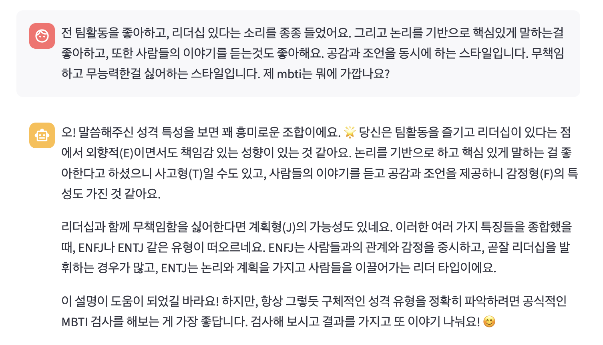
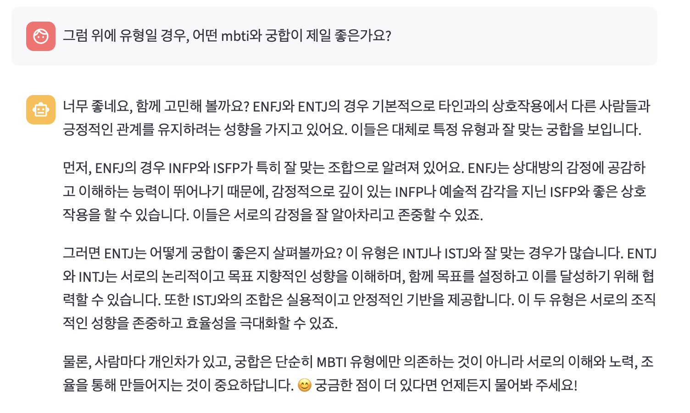
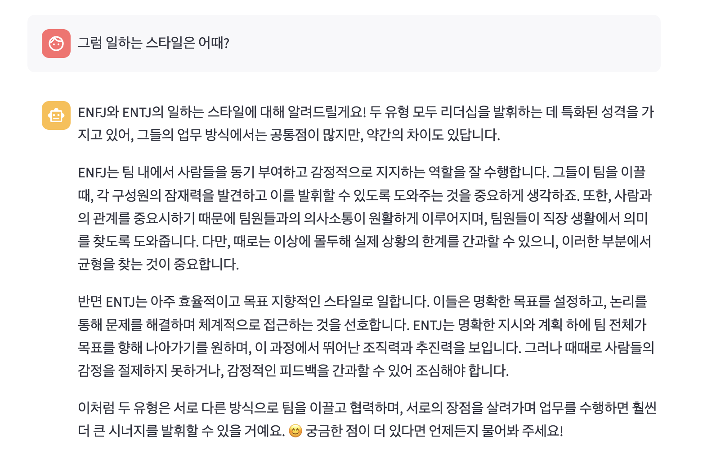
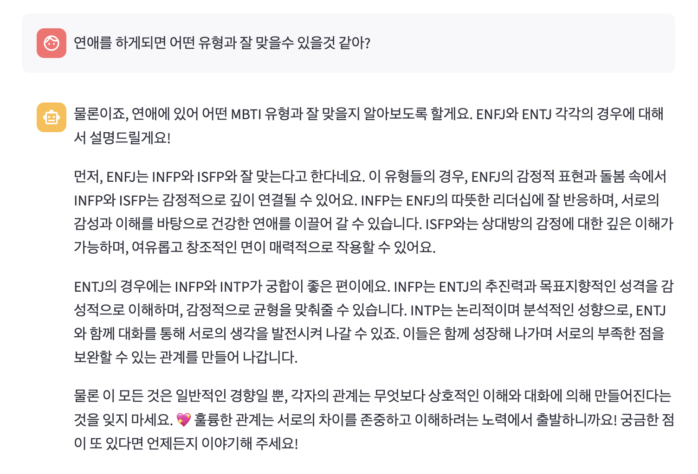

# 💬 MBTI Chatbot


> **RAG + Streamlit 기반 MBTI 챗봇**  
> Pinecone + OpenAI API를 활용하여 MBTI 성격/연애/업무 스타일을 대화형으로 분석하고 대화할 수 있는 웹 애플리케이션입니다.

🔗 **[👉 배포 사이트 바로가기](https://mbti-chatbot-lifeiscabaretpotfolio.streamlit.app/)**  
💻 **[👉 GitHub Repository](https://github.com/lifeiscabaret/MBTI-chatbot)**  

---

## ✨ 주요 기능
- 💬 **MBTI 기반 대화**: 성격, 연애 스타일, 업무 스타일 등 다양한 질문에 답변
- 📚 **RAG 적용**: Pinecone 벡터DB를 활용해 사전 정의된 문서를 검색하여 정확한 답변 제공
- 🎨 **Streamlit UI**: 직관적이고 간단한 웹 인터페이스
-  ⚡ **실시간 대화**: OpenAI GPT 모델 기반 자연스러운 응답

---

## 🖼️ 시연 화면
사용자의 MBTI에 맞는 기본 성격 분석 제공  
### 1. 성격유형 탐색


---

### 2. 맥락 기반 답변 (History-aware Retriever)
대화의 맥락을 기억하여 자연스럽게 이어지는 답변 제공  


---

### 3. 일하는 스타일


---

### 4. 연애 / 궁합

---

## 🛠️ 기술 스택
- **Frontend**: Streamlit
- **Backend / AI**: Python, LangChain, OpenAI API
- **Vector DB**: Pinecone
- **ETC**: dotenv 환경변수 관리, tiktoken 토큰 처리

---

## 📂 프로젝트 구조
```bash
MBTI-chatbot/
│── mbti-chatbot.py       # Streamlit 실행 메인 파일
│── rag.py                # RAG 검색 모듈
│── llm.py                # GPT 연동
│── keyword_dictionary.json # 사전 정의된 키워드
│── requirements.txt      # 의존성 패키지
│── config.py             # 환경변수 세팅
```
---

## 🚀 설치 및 실행 방법

1. **레포지토리 클론**
   ```bash
   git clone https://github.com/lifeiscabaret/MBTI-chatbot.git
   cd MBTI-chatbot
   ```

2. **가상환경 생성 및 패키지 설치**
   ```bash
   pip install -r requirements.txt
   ```

3. **환경변수 (.env) 설정**
   ```bash
   OPENAI_API_KEY=your_api_key
   PINECONE_API_KEY=your_api_key
   ```

4. **실행**
   ```bash
   streamlit run mbti-chatbot.py
   ```